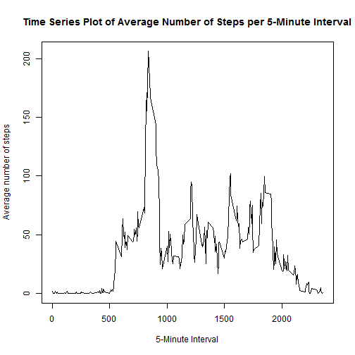

# Reproducible Research: Peer Assessment 1


## Loading and preprocessing the data

First, load the data. 


```r
data <- read.csv("activity.csv", header = TRUE)
#head(data)
```

Datatype is:


```r
typeof(data)
```

```
## [1] "list"
```

Data is not processed into a more suitable format at this stage. 

## What is mean total number of steps taken per day

First, get the total number of steps taken each day with `aggregate` function, ignoring `NA` values. 


```r
day_steps <- aggregate(list(steps = data$steps), by = list(date = data$date), FUN = sum, na.rm = T)
#head(day_steps)
```

Make a histogram of the total number of steps taken each day.


```r
hist_steps <- hist(day_steps$steps, xlab = "Total number of steps", main = "Histogram of Total Number of Steps per Day")
```

 

Then, calculate and report the mean and median total number of steps taken per day. The mean number is: 


```r
mean(day_steps$steps, na.rm = T)
```

```
## [1] 9354
```

The median number is:


```r
median(day_steps$steps, na.rm = T)
```

```
## [1] 10395
```


## What is the average daily activity pattern

Calculate the average number of steps taken in each 5-minute interval, averaged across all days. 


```r
interval_steps <- aggregate(list(steps = data$steps), by = list(interval = data$interval), FUN = mean, na.rm = T)
#head(interval_steps)
```

Make a time series plot (i.e. type = "l") of the 5-minute interval (x-axis) and the average number of steps taken, averaged across all days (y-axis).


```r
plot(x <- interval_steps$interval, y<- interval_steps$steps, type = "l", main = "Time Series Plot of Average Number of Steps per 5-Minute Interval", ylab = "Average number of steps", xlab = "5-Minute Interval")
```

 

To decide Which 5-minute interval, on average across all the days in the dataset, contains the maximum number of steps, simply use `which.max` on the above interval-steps data:


```r
interval_steps$interval[which.max(interval_steps$steps)]
```

```
## [1] 835
```


## Imputing missing values

Note that there are a number of days/intervals where there are missing values (coded as `NA`). The presence of missing days may introduce bias into some calculations or summaries of the data.

First, calculate and report the total number of missing values in the dataset (i.e. the total number of rows with `NA`s), using `complete.cases`:


```r
bad <- which(!complete.cases(data))   #index, not T/F value
length(bad)
```

```
## [1] 2304
```

Now, to fill in all of the missing values in the dataset thus creating a new dataset, use the mean for the relevant 5-minute interval.


```r
new_data <- data
new_data$steps[bad] <- interval_steps$steps[new_data$interval[bad]/5 + 1]
#head(new_data)  
```

Again, use the new dataset to make a histogram of the total number of steps taken each day (ignoring `NA`s).


```r
new_day_steps <- aggregate(list(steps = new_data$steps), by = list(date = new_data$date), FUN = sum, na.rm = T)
#head(new_day_steps)
new_hist_steps <- hist(new_day_steps$steps, xlab = "Total number of steps", main = "Histogram of Total Number of Steps per Day (Imputing Data)")
```

 

Then, use the new dataset to calculate and report the mean and median total number of steps taken per day. The mean number is: 


```r
mean(new_day_steps$steps, na.rm = T)
```

```
## [1] 10282
```

The median number is:


```r
median(new_day_steps$steps, na.rm = T)
```

```
## [1] 10395
```

In the first part of the assignment, the estimates were `9354` and `10395`; now they are `10282` and `10395`. So the mean is increased significantly while the median remains the same after imputing missing data. 


## Are there differences in activity patterns between weekdays and weekends


For this part, the new dataset with filled-in missing values is used. 

Create a new factor variable in the dataset with two levels – “weekday” and “weekend” indicating whether a given date is a weekday or weekend day. Due to non-English language setting problems caused by `weekdays` function, the author uses `wday` instead. (With `wday` function's return values, 0 and 6 represent weekends, and 1, 2, 3, 4, 5 are weekdays.)


```r
new_data$day_type <- as.factor(c("weekend", "weekday", "weekday", "weekday", "weekday", "weekday", "weekend")[as.POSIXlt(new_data$date)$wday + 1])
#head(new_data)
```
    
Compute the average number of steps taken, averaged across weekday days or weekend days. 


```r
type_steps <- aggregate(new_data$steps ~ new_data$interval + new_data$day_type, FUN = mean, na.rm = T)
names(type_steps) <- c("interval", "day_type", "steps")
#head(type_steps)
nrow(type_steps)
```

```
## [1] 576
```

Make a panel plot containing a time series plot (i.e. type = "l") of the 5-minute interval (x-axis) and the average number of steps taken, averaged across all weekday days or weekend days (y-axis). 


```r
#plot(x <- type_steps$interval[1:288], y <- type_steps$steps[1:288], type = "l", main = "Average Number of Steps per 5-Minute Interval (Weekday)", ylab = "Average number of steps", xlab = "5-Minute Interval")
```


```r
#plot(x <- type_steps$interval[289:576], y <- type_steps$steps[289:576], type = "l", main = "Average Number of Steps per 5-Minute Interval (Weekend)", ylab = "Average number of steps", xlab = "5-Minute Interval")
```


```r
library(lattice)
xyplot(steps ~ interval | day_type, group = day_type, data = type_steps, layout = c(1,2), type = "l", main = "Average Number of Steps per 5-Minute Interval", ylab = "Average number of steps", xlab = "5-Minute Interval")
```

 
